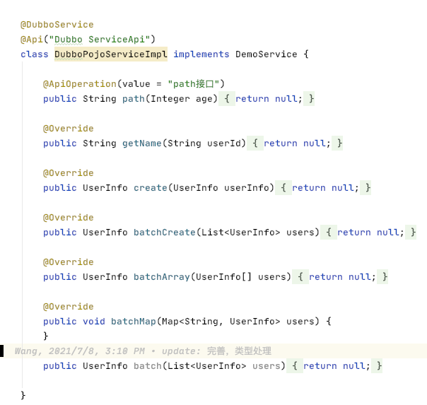

Microservice Toolkit
---
本项目主要是为了生成微服务文档，以及让dubbo等RPC框架快速接入spring-cloud-gateway。

主要功能是：
1. 生成 基于 Open Api 2.0 或者 3.0 的 swagger 格式json。 这样 大家在 基于 网关的 微服务开发模式是，只需要给 Dubbo Service 的实现类 加上 相关的 swagger 2.0，或者 3.0 的注解即可。就跟 普通的  Spring Mvc 项目一样，生成 相关文档。;
2. 生成 Oas(OpenAPI Specification) 元信息方便网关基于Oas信息发起Rpc调用。
3. 实现不同RPC框架接入方便快捷的接入spring-cloud-gateway，已支持Dubbo

参考  Spring-cloud-starter-dubbo  和  dubbo-spi-extensions/blob/2.7.x/dubbo-api-docs 实现 

oas-generator 生成组件： 主要基于 Jaxrs, springmvc, swagger, dubbo等框架注解生成 openApi
dubbo-oas-api 组件， 对外提供 DubboOasService  接口
spring-boot-starter-oas 组件： 主要将 DubboOasService 接口注册成 Dubbo 服务, 提供网关需要的OAS(OpenAPI Specification) 元数据


## 网关如何进行RPC请求转发
网关把Http Request转成 Rpc Request在这个 转换过程中 需要 做如下关键几步：
1. 根据 Http Request 的 Path 和 Http Method  定位 到 RPC Service 中的方法；
2. 将Http Request参数根据 解析成 RPC Service 中的方法的参数，并能进行校验； 
3. 定位到RPC Service 方法和参数后，发起RPC调用;

这个过程让我想到了 swagger:
```yaml
---
swagger: "2.0"
info:
  version: "1.0.0"
  title: "swagger definition for HelloEndPoint"
  x-java-interface: "gen.swagger.HelloEndPoint"
basePath: "/hello"
consumes:
- "application/json"
produces:
- "application/json"
paths:
  /sayHello:
    get:
      operationId: "sayHello"
      parameters:
      - name: "name"
        in: "query"
        required: false
        type: "string"
      responses:
        200:
          description: "response of 200"
          schema:
            type: "string"
  /sayHi:
    get:
      operationId: "sayHi"
      parameters:
      - name: "name"
        in: "query"
        required: false
        type: "string"
      responses:
        200:
          description: "response of 200"
          schema:
            type: "string"
```
但是，这种格式，说白了就是 Swagger 文档的需要的yaml结构，但是和网关需要的结构还差一些，需要做一些转换为了方便网关处理,为了网关 需要的 信息生成的 结构，称为 Oas 元信息。结构如下：
```json
{
  "service" : "DemoService",
  "version" : "",
  "type" : "DubboRest",
  "uriPrefix" : "/pdemo",
  "methods" : [ {
    "path" : "/pdemo/create",
    "httpMethod" : "GET",
    "name" : "create",
    "parameters" : [ {
      "name" : "userInfo",// 参数名
      "in" : "query", // 入参类型： query：request Param参数, path：path 参数, header：header 参数, cookie：cookie 参数, form：表单参数, body: Request Body 参数
      "type" : "UserInfo",  // 参数类型
      "required" : true,
      "index" : 0,  // 参数位置
      "ref" : "#/components/schemas/UserInfo",
      "itemType" : "UserInfo",
      "itemProperties" : { // 如果参数 是 自定义类， 包含的 类属性名以及类型
        "name" : "java.lang.String",
        "id" : "java.lang.Integer",
        "avatar" : "java.lang.String"
      }
    } ],
    "returnType" : "UserInfo"
  }, {
    "path" : "/pdemo/batchArray",
    "httpMethod" : "GET",
    "name" : "batchArray",
    "parameters" : [ {
      "name" : "users",
      "in" : "query",
      "type" : "UserInfo[]",
      "required" : true,
      "index" : 0,
      "itemType" : "UserInfo",
      "itemProperties" : {
        "name" : "java.lang.String",
        "id" : "java.lang.Integer",
        "avatar" : "java.lang.String"
      }
    } ],
    "returnType" : "UserInfo"
  }, {
    "path" : "/pdemo/batchCreate",
    "httpMethod" : "POST",
    "name" : "batchCreate",
    "parameters" : [ {
      "name" : "users",
      "in" : "query",
      "type" : "java.util.List",
      "required" : true,
      "index" : 0,
      "itemType" : "UserInfo",
      "itemProperties" : {
        "name" : "java.lang.String",
        "id" : "java.lang.Integer",
        "avatar" : "java.lang.String"
      }
    } ],
    "returnType" : "UserInfo"
  }, {
    "path" : "/pdemo/path",
    "httpMethod" : "GET",
    "name" : "path",
    "parameters" : [ {
      "name" : "age",
      "in" : "query",
      "type" : "java.lang.Integer",
      "required" : true,
      "index" : 0,
      "format" : "int32"
    } ],
    "returnType" : "java.lang.String"
  }, {
    "path" : "/pdemo/getName",
    "httpMethod" : "GET",
    "name" : "getName",
    "parameters" : [ {
      "name" : "userId",
      "in" : "query",
      "type" : "java.lang.String",
      "required" : true,
      "index" : 0
    } ],
    "returnType" : "java.lang.String"
  }, {
    "path" : "/pdemo/batchMap",
    "httpMethod" : "GET",
    "name" : "batchMap",
    "parameters" : [ {
      "name" : "users",
      "in" : "query",
      "type" : "java.util.Map",
      "required" : true,
      "index" : 0
    } ],
    "returnType" : "void"
  } ],
  "schemas" : {
    "UserInfo" : {
      "type" : "object",
      "properties" : {
        "id" : {
          "type" : "integer",
          "format" : "int32"
        },
        "name" : {
          "type" : "string"
        },
        "avatar" : {
          "type" : "string"
        }
      }
    }
  }
}
```
以上 信息 是 根据 如下  Dubbo Service 生成的
````java
@DubboService
@Path("/pdemo")
class DubboJaxrsServiceImpl implements DemoService {
 
    @Path("/path")
    @GET
    public String path(Integer age) {
        return null;
    }
 
    @Override
    public String getName(String userId) {
        return null;
    }
 
    @Override
    @GET
    public UserInfo create(UserInfo userInfo) {
        return null;
    }
 
    @Override
    @POST
    public UserInfo batchCreate(List<UserInfo> users) {
        return null;
    }
 
    @Override
    public UserInfo batchArray(UserInfo[] users) {
        return null;
    }
 
    @Override
    public void batchMap(Map<String, UserInfo> users) {
    }
 
    public UserInfo batch(List<UserInfo> users) {
        return null;
    }
 
}
````
基于 以上 Oas 元信息  就可以很方便的 将 http 请求 转为 dubbo 调用 如：

1. GET：/pdemo/create  表示， 访问的是 Dubbo 服务名为:  DemoService  方法为：create  的 服务，  参数 只有一个名为: userInfo 的 复合参数;
2. POST：/pdemo/batchCreate  表示， 访问的是 Dubbo 服务名为:   DemoService  方法为：batchCreate, 参数 是 list类型，通过body 传入;

## 支持的开发模式
microservice-toolkit  是 以 OpenAPI Specification (OAS)  规范(2.0 或者 3.0 )为基础，可以理解为就是以 swagger 2.0 或者 3.0 的注解 为基础。在这个基础上 支持 如下 3种开发模式:

#### Dubbo 开发模式： 
就是 纯 Dubbo Service 定义方式， 如下图：


基于 上图 生成的  Oas 元信息如下：
```json
  "service" : "DemoService",
  "version" : "",
  "type" : "Dubbo",
  "uriPrefix" : "/dubboPojo",  // service uri 前缀 是 将  DubboPojoServiceImpl 去掉 ServiceImpl 转小写得到的。
  "methods" : [ {
    "path" : "/dubboPojo/batchArray",
    "httpMethod" : "GET",
    "name" : "batchArray",
    "parameters" : [ {
      "name" : "users",
      "in" : "query",
      "type" : "UserInfo[]",
      "required" : true,
      "index" : 0,
      "itemType" : "UserInfo",
      "itemProperties" : {
        "name" : "java.lang.String",
        "id" : "java.lang.Integer",
        "avatar" : "java.lang.String"
      }
    } ],
    "returnType" : "UserInfo"
  }, {
    "path" : "/dubboPojo/create",
    "httpMethod" : "POST",
    "name" : "create",
    "parameters" : [ {
      "name" : "userInfo",
      "in" : "query",
      "type" : "UserInfo",
      "required" : true,
      "index" : 0,
      "ref" : "#/components/schemas/UserInfo",
      "itemType" : "UserInfo",
      "itemProperties" : {
        "name" : "java.lang.String",
        "id" : "java.lang.Integer",
        "avatar" : "java.lang.String"
      }
    } ],
    "returnType" : "UserInfo"
  }, {
    "path" : "/dubboPojo/batchMap",
    "httpMethod" : "GET",
    "name" : "batchMap",
    "parameters" : [ {
      "name" : "users",
      "in" : "query",
      "type" : "java.util.Map",
      "required" : true,
      "index" : 0
    } ],
    "returnType" : "void"
  }, {
    "path" : "/dubboPojo/path",
    "httpMethod" : "GET",
    "name" : "path",
    "parameters" : [ {
      "name" : "age",
      "in" : "query",
      "type" : "java.lang.Integer",
      "required" : true,
      "index" : 0,
      "format" : "int32"
    } ],
    "returnType" : "java.lang.String"
  }, {
    "path" : "/dubboPojo/batchCreate",
    "httpMethod" : "GET",
    "name" : "batchCreate",
    "parameters" : [ {
      "name" : "users",
      "in" : "query",
      "type" : "java.util.List",
      "required" : true,
      "index" : 0,
      "itemType" : "UserInfo",
      "itemProperties" : {
        "name" : "java.lang.String",
        "id" : "java.lang.Integer",
        "avatar" : "java.lang.String"
      }
    } ],
    "returnType" : "UserInfo"
  }, {
    "path" : "/dubboPojo/getName",
    "httpMethod" : "GET",
    "name" : "getName",
    "parameters" : [ {
      "name" : "userId",
      "in" : "query",
      "type" : "java.lang.String",
      "required" : true,
      "index" : 0
    } ],
    "returnType" : "java.lang.String"
  } ],
  "schemas" : {
    "UserInfo" : {
      "type" : "object",
      "properties" : {
        "id" : {
          "type" : "integer",
          "format" : "int32"
        },
        "name" : {
          "type" : "string"
        },
        "avatar" : {
          "type" : "string"
        }
      }
    }
  }
}
```

Dubbo Service 的 uriPrefix:  可以理解为 就是 Spring Mvc Controller 类上加的 RequestMapping,  在没有指定 @DubboService(path=) 的情况下 默认的处理规则为：去掉 Dubbo Service 实现类的名字中的  RpcServiceImpl，RestService，RestServiceImpl，ServiceImpl 字符，然后 将剩余字符，首字母转小写， 如：DubboPojoServiceImpl  处理之后  /dubboPojo  就是DubboPojoService 的 uri 前缀，等同于 Spring Mvc Controller 类上加的 @RequestMapping(path="/dubboPojo")

Dubbo Service  Method Path:   Dubbo Service 的 uriPrefix +  方法 path。  方法 path 就是 方法名字。

Http Method 如果确定：
1. 以  get,find,query,select,list 开头的 方法，都是 GET
2. 以  save,add,update,create 开头 的方法 都是 POST
3. 以  put 开头的方法 都是  PUT
4. 以 delete, remove, del 开头的方法 都是  DELETE

Dubbo 入参类型(query：request Param参数, path：path 参数, header：header 参数, cookie：cookie 参数, form：表单参数, body: Request Body 参数 ) 如何确定：
> 默认情况下 都是 query类型的入 参， 如果 是  POST 类型，并且 参数 只有一个 自定义类型，则是 body 类型的入参

### Spring Mvc + Dubbo  开发模式：
Spring Mvc + Dubbo 开发模式，则利用了 Spring Mvc 的注解 更加灵活的定义 Path  以及入参 类型，因此，Spring Mvc  所有 参数处理注解，以及 路径处理的相关注解都支持。

### 从而可以更好的符合 大家的开发习惯
Jaxrs + Dubbo 开发模式 跟  Spring Mvc + Dubbo 开发模式 一样，支持  Jaxrs 相关的 路径以及参数 定义注解， 从而可以更好的符合 大家的开发习惯

